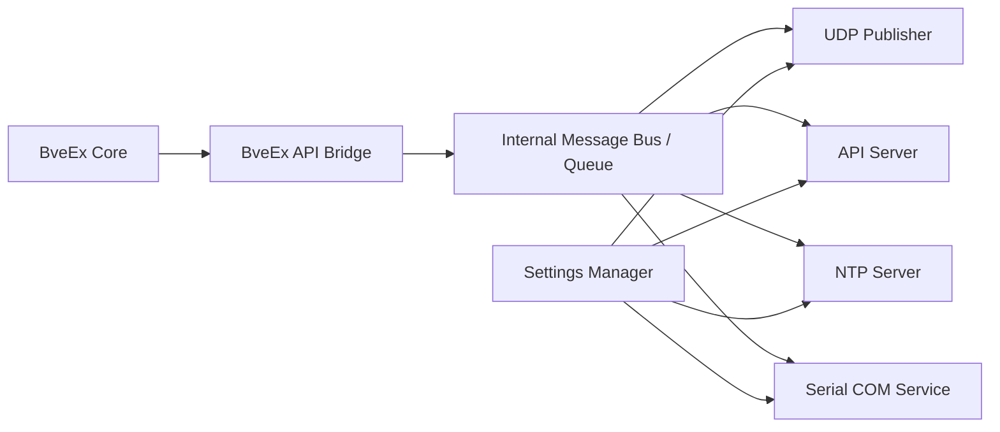

# 01. 概要と全体アーキテクチャ

## 目的

BveEx から取得できる情報・時刻・入出力 API を、外部システムへ柔軟に公開する。

公開手段:

1. UDP
2. API サーバー（ネットワーク）
3. NTP サーバー
4. シリアル（COM）通信

また、BveEx 本体をブロッキングしないため、通信処理は別スレッドで実行する。

## 全体アーキテクチャ

## コンセプト

- BveEx 入出力をそのまま外部化（変換は最小限）
- パケット構造は通信方式ごとに独立定義する（共通化しない）
- 複数通信方式を同時利用可能にする
- シリアル通信は BIDSid_SerCon の CommandList 互換を重視する
