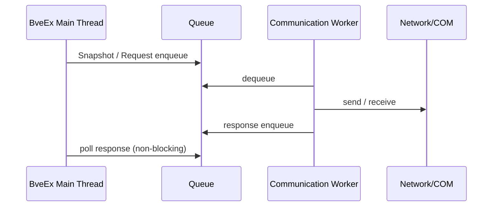

# 08. スレッド設計

## 目的

BveEx メイン処理のリアルタイム性維持（非ブロッキング）。

## 基本方針

- BveEx API 呼び出しは最小限・短時間
- 通信 I/O は別スレッド（またはワーカープール）で実行
- メッセージキューで BveEx 側と通信側を疎結合化

## 推奨実装ポイント

- キュー上限設定と過負荷時ポリシー（ドロップ / 最新優先）を明確化
- シャットダウン時の安全停止
- 例外発生時に BveEx 側へ影響を波及させない
